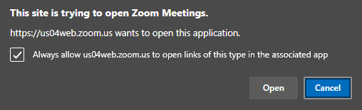

# Auto Join Zoom Meetings
**Allow the browser to open the corresponding app**


or go to

**Edge**
```
edge://settings/content/applicationLinks?search=open
```

**Install the Requirements and Run**
1. Install Python
    ```
    https://www.python.org/downloads/release/python-3910/
    ```
2. Clone the Repository to your desktop or download it
    ```
    https://github.com/kenji1902/AutoJoinZoom.git
    ```
3. Create a virtual environment 
    ```
    python -m venv .venv
    ```
4. Install the requirements
    ```
    pip install requirements.txt 
    ```
5. Run the main Script
    ```
    python Scripts/main.py
    ```

**Schedule Excel File**
- located in Assets/excel/schedule.xlsx, and insert the Meeting requirements